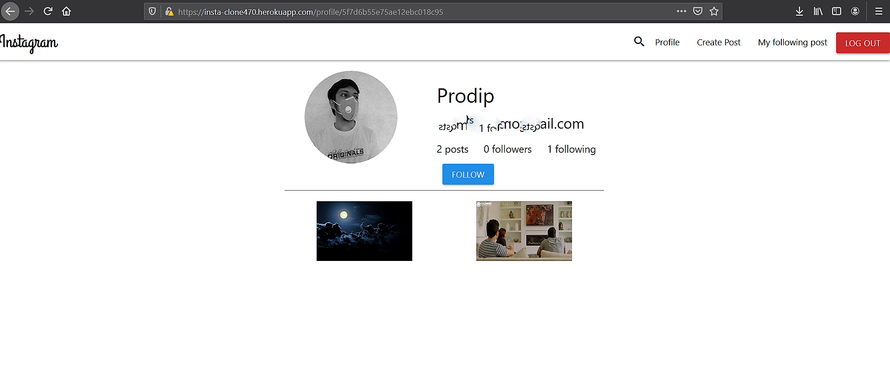

# Insta-Clone - An working clone of Instagram
This is a mern stack app

#All emails are hidden for security purposes

After downloading , go to client directory in cmd / vscode and put command "npm install" to install all dependencies and also in root directory for server dependencies.
Also create a dev folder for putting database and other required API keys
Ignore the "shots" folder, it contain the screenshots for proof.

# Server Requirements

    "bcryptjs"
    "cors"
    "dotenv"
    "express"
    "jsonwebtoken"
    "mongoose"
    "nodemailer"
    "nodemailer-sendgrid-transport"
    
 
  
# Client Requirements

    "materialize-css"
    "react"
    "react-dom"
    "react-router-dom"
    
 

#Here are the working screenshots

# signup
User can create an account with name, email, password and profile pic(optional)
signup.PNG

For which an email confirmation will be sent to your gmail

# signinpage

# Home Page
with like comment and delete(for only logged in personal post)

# Profile page
With an sect to update user profile

# Follow others 
With follow or unfollow button

# Posting
Logged in users can post with body title and select file from device

# Password Reset
User can reset their passwood by email authentication, where link in email will be valid for 1hr only.

#Choose your desired platform to host.......goodluck.
